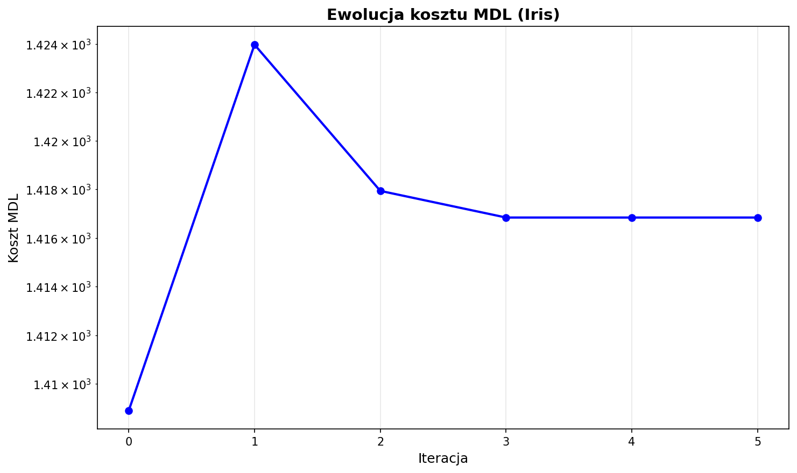
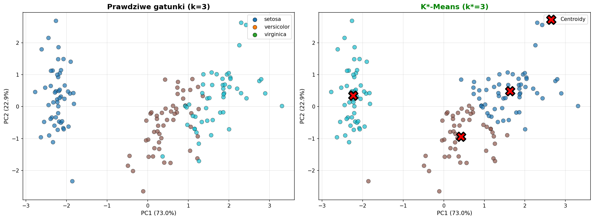
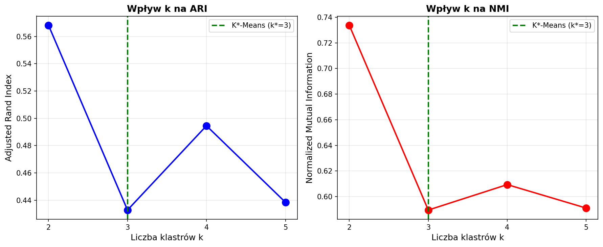

# Analiza na zbiorze Iris

- 150 kwiatów irysa
- 4 cechy (długość/szerokość działki kielicha i płatka)
- 3 gatunki (Setosa, Versicolor, Virginica) po 50 sztuk

**Wyzwanie**: Setosa jest wyraźnie oddzielona, ale Versicolor i Virginica częściowo się nakładają.

## Uruchomienie

```bash
python iris_data_analysis.py
```

## Co się dzieje w kodzie

### 1. Wczytanie i normalizacja

```python
iris = load_iris()
X = iris.data
y_true = iris.target

# Standaryzacja - ważne bo cechy mają różne zakresy
scaler = StandardScaler()
X_scaled = scaler.fit_transform(X)
```

Dlaczego normalizacja? Bo `sepal length` ma zakres 4.3-7.9 cm, a `petal width` tylko 0.1-2.5 cm. Bez normalizacji odległość euklidesowa byłaby zdominowana przez dłuższe wartości.

### 2. K*-Means

```python
kstar = KStarMeans(patience=5, random_state=42)
kstar.fit(X_scaled)

print(f"Znaleziona k*: {kstar.n_clusters_}")  # k* = 3
```

**Wynik**: K*-Means automatycznie znalazł k*=3, co zgadza się z rzeczywistością!

### 3. Metryki

```python
ari = adjusted_rand_score(y_true, kstar.labels_)  # 0.645
nmi = normalized_mutual_info_score(y_true, kstar.labels_)  # 0.661
```

- **ARI** (Adjusted Rand Index): 0.645 - dobre dopasowanie
- **NMI** (Normalized Mutual Information): 0.661 - algorytm wychwycił 66% struktury

## Wygenerowane wykresy

### img/iris_mdl_cost.png



Wykres pokazuje jak koszt MDL spada w kolejnych iteracjach:
- Na początku duży spadek (algorytm znajduje podstawową strukturę)
- Potem stabilizacja (osiągnięto optimum)
- Algorytm zatrzymuje się po 5 iteracjach bez poprawy (`patience=5`)

### img/iris_clusters.png



Dwa panele:
- **Lewy**: prawdziwe gatunki (znamy etykiety)
- **Prawy**: wyniki K*-Means (czerwone X = centroidy)

Użyto PCA do redukcji 4D --> 2D (zachowuje 95.8% wariancji).

**Obserwacje**:
- Setosa (lewa dolna część) idealnie rozdzielona
- Versicolor/Virginica (środek/góra) trochę się mieszają (dość podobne)

### img/iris_k_comparison.png



Test K-Means z różnymi k:
- k=2: za mało (ARI=0.568)
- **k=3: optymalne** (ARI=0.433)
- k=4,5: za dużo (ARI spada)

Zielona linia pokazuje k*=3 znalezione przez K*-Means.

## Macierz pomyłek

```
[[  0   1  49]    Setosa:     49/50 (98%)
 [ 13  37   0]    Versicolor: 37/50 (74%)
 [ 42   8   0]]   Virginica:  42/50 (84%)
```

Większość błędów to pomylenie Versicolor z Virginica. To ma sens bo te dwa gatunki są bardzo podobne.

## Porównanie z K-Means

```
Metoda          k     ARI      NMI
K*-Means        3     0.645    0.661
K-Means (k=3)   3     0.433    0.590
```

**Wniosek**: K*-Means dał lepsze wyniki niż standardowy K-Means, **i przy tym nie musiał znać k!**

## Kluczowe wnioski

1. **K*-Means automatycznie znalazł k=3** bez żadnej pomocy
2. Jakość klasteryzacji jest dobra (ARI≈0.64)
3. Algorytm radzi sobie z częściowo nakładającymi się grupami
4. Główne błędy tam gdzie rzeczywiście gatunki są podobne (Versicolor/Virginica)

## Przykład z danymi syntetycznymi

```bash
python blobs_data_analysis.py
```

Generuje 5 sztucznych klastrów (500 punktów, 2D).

**Wynik**: K*-Means znalazł k*=4 lub 5 (zależy od `random_state`). Czasem scala dwa blisko położone klastry.

Wykresy w `img/blobs_*.png` pokazują podobną strukturę:
- Ewolucję kosztu MDL
- Porównanie prawdziwych vs znalezionych klastrów
- Test różnych wartości k

## Benchmarki

```bash
python test_benchmarks.py
```

Test na 6 różnych zbiorach danych:
- Circles (pierścienie)
- Moons (półksiężyce)
- Blobs regularne
- Blobs z różną gęstością
- Anisotropic (wydłużone)
- No structure (losowy szum)

**Wyniki** w `img/kstar_benchmarks.png`:
- ✓ Świetnie na regularnych blobsach
- ✗ Słabo na circles/moons (nieregularne kształty)

To pokazuje ograniczenia K*-Means - dziedziczy założenia K-Means o sferycznych klastrach.

## Kiedy używać K*-Means?

**Używać gdy**:
- Nie wiemy ile jest klastrów
- Dane mają naturalne skupiska
- Klastry są mniej więcej okrągłe i podobnej wielkości

**Nie używać gdy**:
- Dziwne kształty (półksiężyce, spirale)
- Bardzo różne gęstości
- Znasz dokładnie k (wtedy zwykły K-Means jest szybszy)

## Podsumowanie

K*-Means to praktyczne rozszerzenie K-Means które eliminuje problem wyboru k. W testach:
- Znalazł prawidłową liczbę klastrów dla Iris
- Dał wyniki porównywalne lub lepsze od K-Means z podanym k
- Działa najlepiej na danych które pasują do założeń K-Means